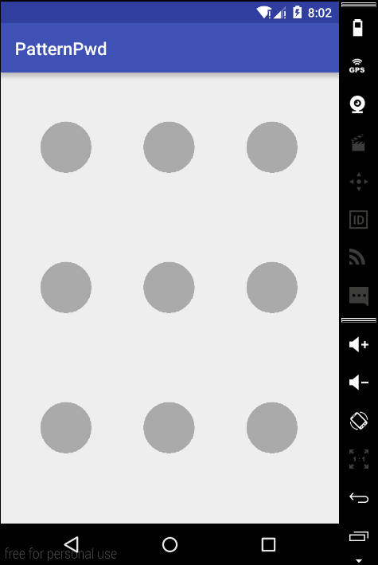

# PatternPwd

#### 简介
九宫格加密，继承 surfaceview 自己绘制

#### 使用方法

```
<RelativeLayout xmlns:android="http://schemas.android.com/apk/res/android"
    xmlns:app="http://schemas.android.com/apk/res-auto"
    xmlns:tools="http://schemas.android.com/tools"
    android:layout_width="match_parent"
    android:layout_height="match_parent"
    android:paddingBottom="@dimen/activity_vertical_margin"
    android:paddingLeft="@dimen/activity_horizontal_margin"
    android:paddingRight="@dimen/activity_horizontal_margin"
    android:paddingTop="@dimen/activity_vertical_margin"
    tools:context="zy.com.patternpwd.MainActivity">

    <zy.com.patternpwd.PatternView
        android:id="@+id/patternview"
        android:layout_width="match_parent"
        android:layout_height="match_parent"
        app:count="3" //每行多少个图案
        app:backgroundColor="@android:color/transparent" // 背景颜色
        app:originalColor="@android:color/darker_gray" // 初始颜色
        app:chooseColor="@android:color/holo_blue_bright"/> // 选择后的颜色

</RelativeLayout>

public class MainActivity extends AppCompatActivity {

    @Override
    protected void onCreate(Bundle savedInstanceState) {
        super.onCreate(savedInstanceState);
        setContentView(R.layout.activity_main);

        final PatternView view = (PatternView) findViewById(R.id.patternview);
        view.setListener(new PwdListener() { // 设置监听
            @Override
            public void patternStart() {

            }

            @Override
            public void patternAdd(int point) {

            }

            @Override
            public void patternEnd(List<Integer> pattern) {
                StringBuilder builder = new StringBuilder();
                for (Integer i : pattern){
                    builder.append(i).append(",");
                }
                AlertDialog dialog = new AlertDialog.Builder(MainActivity.this)
                        .setMessage("pattern finish : " + builder.toString())
                        .create();
                dialog.show();
                view.clearAll();
            }
        });
    }
}
```

#### 效果
